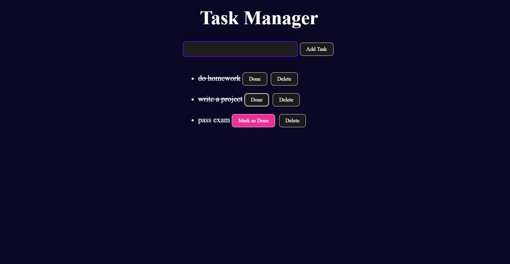
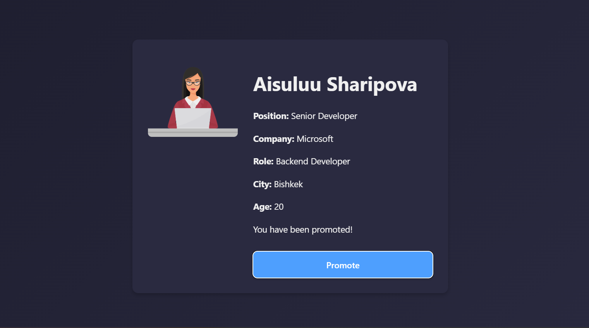
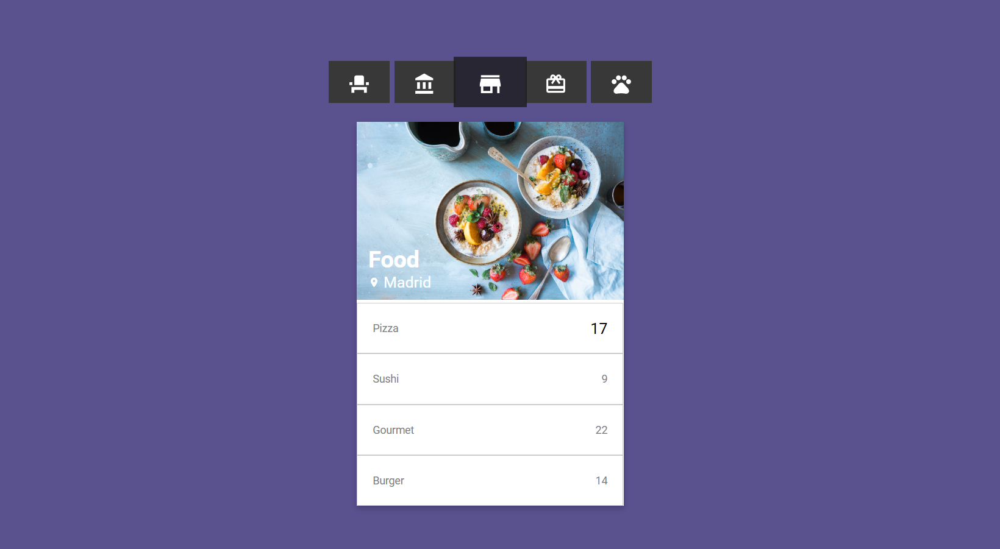
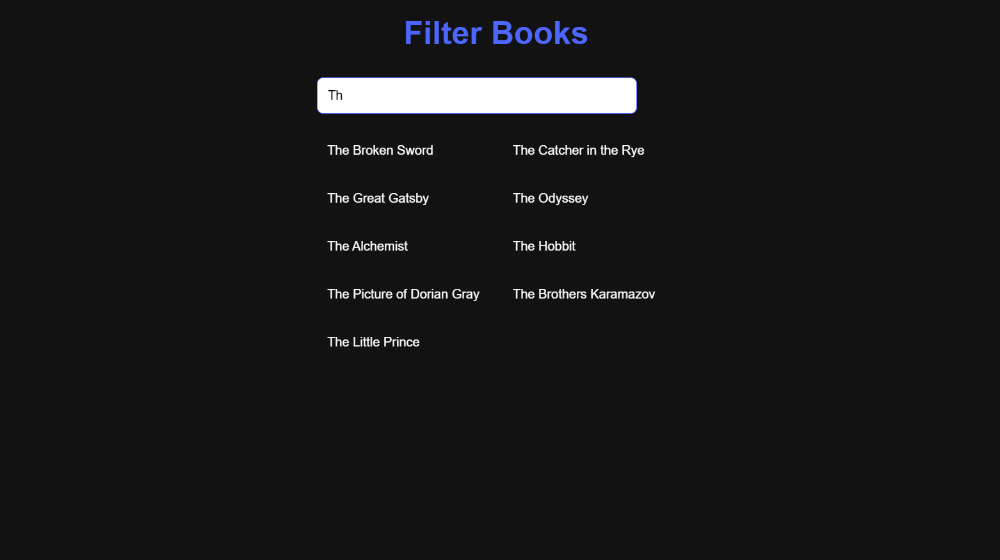
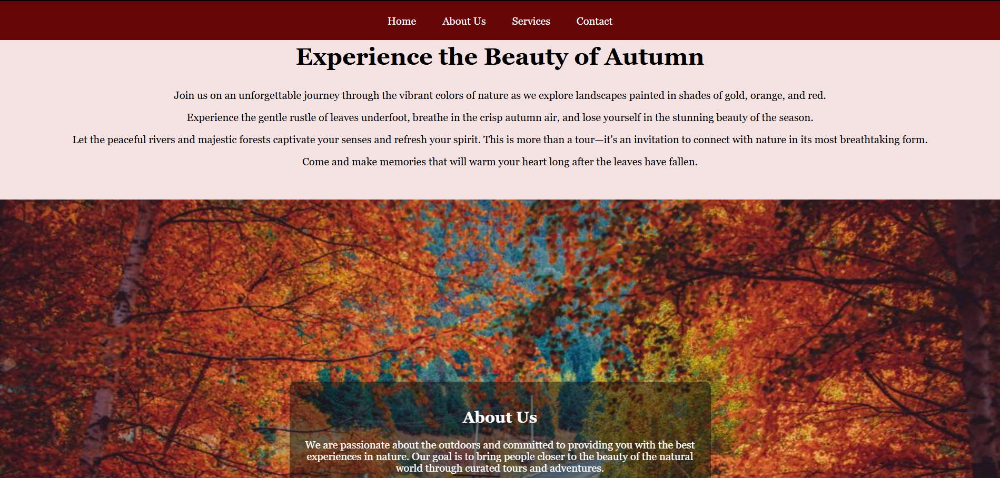
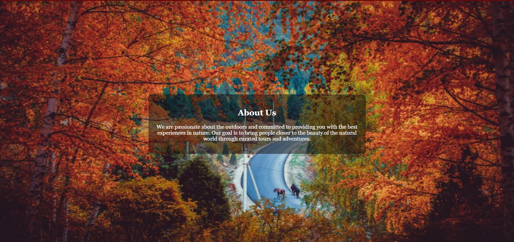
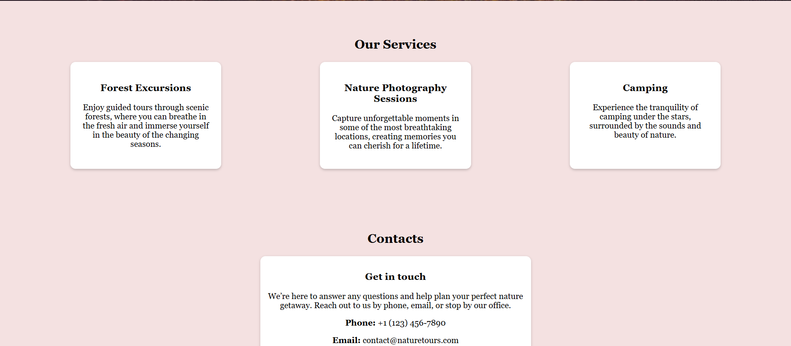

# Frontend Course

## Task Manager

Below is an example of how the Task Manager looks:

## React project

Below is an example of how the React project looks:

## Assets

Below is an example of how the assets section looks:

## Filter App

Below is an example of how the Filter App looks:

## Translator project

Below is an example of how the Translator project looks:

.mp4)

## Html-css task

Below is an example of how the Html-css task looks:

